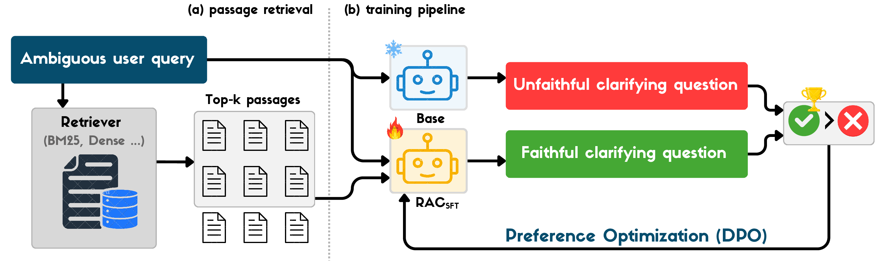
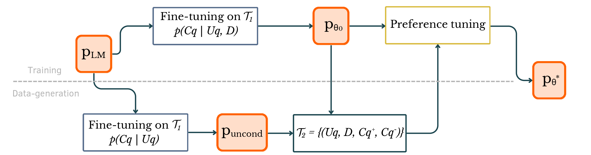

# RAC-Retrieval-augmented-clarifcation

Clarification questions help conversational search systems resolve ambiguous or underspecified queries. However, most prior approaches risk asking questions that are not grounded in the corpus, leading to misleading interactions. We propose RAC (Retrieval-Augmented Clarification), a framework for generating faithful clarifying questions.

<p align="center">
  
  <br>
  <em>Figure 1. Overview of RAC. Given an ambiguous user query, the system first retrieves the top-$k$ passages ((a) passage retrieval). A mixture of the fine-tuned model and the base model is then used to generate unfaithful clarifying questions. Both faithful and unfaithful clarifying questions are subsequently leveraged for preference optimization via the DPO algorithm ((b) training pipeline). During inference, the trained model directly generates faithful clarifying questions.</em>
</p>


In the following we will go through the execution of each component of RAC pipeline.

<p align="center">
  
  <br>
  <em>Figure 2. Overview of RAC training pipeline.</em>
</p>


## 🚀 Installation & Environment Setup

```bash
# Create virtual environment
conda create -n rac_env python=3.10
conda activate rac_env

# Install dependencies
pip install -r requirements.txt
```

Login to huggingface

```bash
huggingface-cli login --token "..."
```

or export the env variable

```bash
export HF_TOKEN=""
```

## ⚙️ Configure Environment Variables in `job_run_src.sh`

Before running the RAC pipeline, make sure you correctly configure the following environment variables.
These define where your code, datasets, and model files live, as well as how your GPU and offline modes are handled.

## 📊 Fine-tuning

To fine-tune the model, replace `DATASET_NAME` with your chosen dataset.

* Open datasets are available in the `./data` folder.
* **Note**: Qulac and ClariQ augmented datasets are not included due to the ClueWeb09/12 license restrictions.
  However, if you have access to a ClueWeb index, you can use the data augmentation scripts provided in the `./data_augmentation` folder to reproduce the augmented datasets.

### Example command:


```bash

bash job_run_src.sh --finetune model.name=meta-llama/Llama-3.1-8B model.tokenizer_name=meta-llama/Llama-3.1-8B model.Qlora=False dataset.name=DATASET_NAME model.learning_rate=5e-5 dataset.fine_tune_path=../data/DATASET_NAME/DATASET_train.json dataset.eval_dataset=../data/DATASET_NAME/DATASET_dev.jsonl model.num_epochs=1 model.per_device_train_batch_size=32 model.bf16=True model.lr_scheduler_type=linear model.gradient_checkpointing=True model.gradient_accumulation_steps=2 mixture.num_variants=1 mixture.dpo_bs=32 run.gen_run_id=GEN_ID run.eval_run_id=RUN_ID model.chat=False

```

## Second finetuning of the $Uncond$ model

Second finetuning to train the model conditioned only on query.

```bash
bash job_run_src.sh --uncond model.name=meta-llama/Llama-3.1-8B model.tokenizer_name=meta-llama/Llama-3.1-8B model.Qlora=False dataset.name=DATASET_NAME model.learning_rate=5e-5 dataset.fine_tune_path=../data/DATASET_NAME/DATASET_train.json dataset.eval_dataset=../data/DATASET_NAME/DATASET_dev.jsonl  dataset.train_test_split=0.5 model.num_epochs=1 model.per_device_train_batch_size=32 model.bf16=True model.lr_scheduler_type=linear model.gradient_checkpointing=True model.gradient_accumulation_steps=2 mixture.num_variants=1 mixture.dpo_bs=32 run.gen_run_id=GEN_ID run.eval_run_id=RUN_ID model.chat=False dpo.untouched=0
```


## Noisy data generation (rejected data samples $Cq^-$)

Generate the noisy samples which will be used by the next step of the pipeline to train dpo, 

```bash
bash job_run_src.sh --data-generation model.name=meta-llama/Llama-3.1-8B model.tokenizer_name=meta-llama/Llama-3.1-8B model.Qlora=False dataset.name=DATASET_NAME model.learning_rate=5e-5 dataset.fine_tune_path=../data/DATASET_NAME/DATASET_train.json dataset.eval_dataset=../data/DATASET_NAME/DATASET_dev.jsonl dataset.train_test_split=0.5 model.num_epochs=1 model.per_device_train_batch_size=32 model.bf16=True model.lr_scheduler_type=linear model.gradient_checkpointing=True model.gradient_accumulation_steps=2 mixture.alpha=0.7 dpo.per_device_train_batch_size=32 dpo.num_epochs=2 dpo.learning_rate=4e-6 dpo.beta=0.2 dpo.bf16=True dpo.max_grad_norm=1.0 dpo.warmup_ratio=0.1 dpo.loss_type="dpo" dpo.loss="dpo" mixture.bs=32 mixture.num_variants=1 mixture.dpo_bs=32 run.gen_run_id=GEN_ID run.eval_run_id=RUN_ID model.chat=False dpo.untouched=0
```


## DPO training

```bash
bash job_run_src.sh --data-training model.name=meta-llama/Llama-3.1-8B model.tokenizer_name=meta-llama/Llama-3.1-8B model.Qlora=False dataset.name=DATASET_NAME model.learning_rate=5e-5 dataset.fine_tune_path=../data/DATASET_NAME/DATASET_train.json dataset.eval_dataset=../data/DATASET_NAME/DATASET_dev.jsonl dataset.train_test_split=0.5 model.num_epochs=1 model.per_device_train_batch_size=32 model.bf16=True model.lr_scheduler_type=linear model.gradient_checkpointing=True model.gradient_accumulation_steps=2 mixture.alpha=0.7 dpo.per_device_train_batch_size=32 dpo.num_epochs=2 dpo.learning_rate=4e-6 dpo.beta=0.2 dpo.bf16=True dpo.max_grad_norm=1.0 dpo.warmup_ratio=0.1 dpo.loss_type="dpo" dpo.loss="dpo" mixture.bs=32 mixture.num_variants=1 mixture.dpo_bs=32 run.gen_run_id=GEN_ID run.eval_run_id=RUN_ID model.chat=False dpo.untouched=0
```

## Evaluation

For evaluation, we need to first generate the data using the final trained dpo model, then calculate metrics, both the reference based metrics and the faihthfulness (reference free metrics)

### Eval data generation

```bash
bash job_run_src.sh --data-generation-dpo model.name=meta-llama/Llama-3.1-8B model.tokenizer_name=meta-llama/Llama-3.1-8B model.Qlora=False dataset.name=DATASET_NAME model.learning_rate=5e-5 dataset.fine_tune_path=../data/DATASET_NAME/DATASET_train.json dataset.eval_dataset=../data/DATASET_NAME/DATASET_dev.jsonl dataset.train_test_split=0.5 model.num_epochs=1 model.per_device_train_batch_size=32 model.bf16=True model.lr_scheduler_type=linear model.gradient_checkpointing=True model.gradient_accumulation_steps=2 mixture.alpha=0.7 dpo.per_device_train_batch_size=32 dpo.num_epochs=2 dpo.learning_rate=4e-6 dpo.beta=0.2 dpo.bf16=True dpo.max_grad_norm=1.0 dpo.warmup_ratio=0.1 dpo.loss_type="dpo" dpo.loss="dpo" mixture.bs=32 mixture.num_variants=1 mixture.dpo_bs=32 run.gen_run_id=GEN_ID run.eval_run_id=RUN_ID model.chat=False dpo.untouched=0
```

### Reference based metrics

```bash
bash job_run_src.sh --metrics model.name=meta-llama/Llama-3.1-8B model.tokenizer_name=meta-llama/Llama-3.1-8B model.Qlora=False dataset.name=DATASET_NAME model.learning_rate=5e-5 dataset.fine_tune_path=../data/DATASET_NAME/DATASET_train.json dataset.eval_dataset=../data/DATASET_NAME/DATASET_dev.jsonl dataset.train_test_split=0.5 model.num_epochs=1 model.per_device_train_batch_size=32 model.bf16=True model.lr_scheduler_type=linear model.gradient_checkpointing=True model.gradient_accumulation_steps=2 mixture.alpha=0.7 dpo.per_device_train_batch_size=32 dpo.num_epochs=2 dpo.learning_rate=4e-6 dpo.beta=0.2 dpo.bf16=True dpo.max_grad_norm=1.0 dpo.warmup_ratio=0.1 dpo.loss_type="dpo" dpo.loss="dpo" mixture.bs=32 mixture.num_variants=1 mixture.dpo_bs=32 run.gen_run_id=GEN_ID run.eval_run_id=RUN_ID model.chat=False dpo.untouched=0
```

### Reference free metrics


#### 🧩 Input Format

Your dataset must be in **JSON Lines** format (`.json`) containing at least the following fields:

```yaml
| Field | Description |
|-------|--------------|
| `ground-truth` | Reference question or gold text (used for merging) |
| `Passage` | List or string of passages retrieved for the question |
| `dpo` / `sft` / `fine_tuned` | Model predictions to evaluate |

```
Example (`dataset.json`):

```json
{"ground-truth": "Who wrote the Harry Potter series?", 
 "Passage": ["# J.K. Rowling is the author of the Harry Potter series."], 
 "dpo": ["Are you looking for information about who wrote Harry Potter?"]}
```

#### Adapted Align-score 

```bash
conda create -n alignscore python=3.10 -y
cd src/evaluation/alignscore
conda activate alignscore

pip install -r requirements.txt
python -m spacy download en_core_web_sm
```

##### Example command 


For the Final dpo model

```bash
python align_eval_adapted.py \
  --source dpo \
  --dataset /path/to/generated_data.json
```

### Adapted Parent

```bash
conda activate rac_env
```


```bash
python parent_metric.py \
 --source dpo \
  --dataset /path/to/generated_data.json
```


## Disclaimer

This repository assumes a SLURM-based cluster environment.
Scripts include SLURM directives and commands; if your setup uses a different scheduler, please modify those parts to match your system’s job submission syntax.


